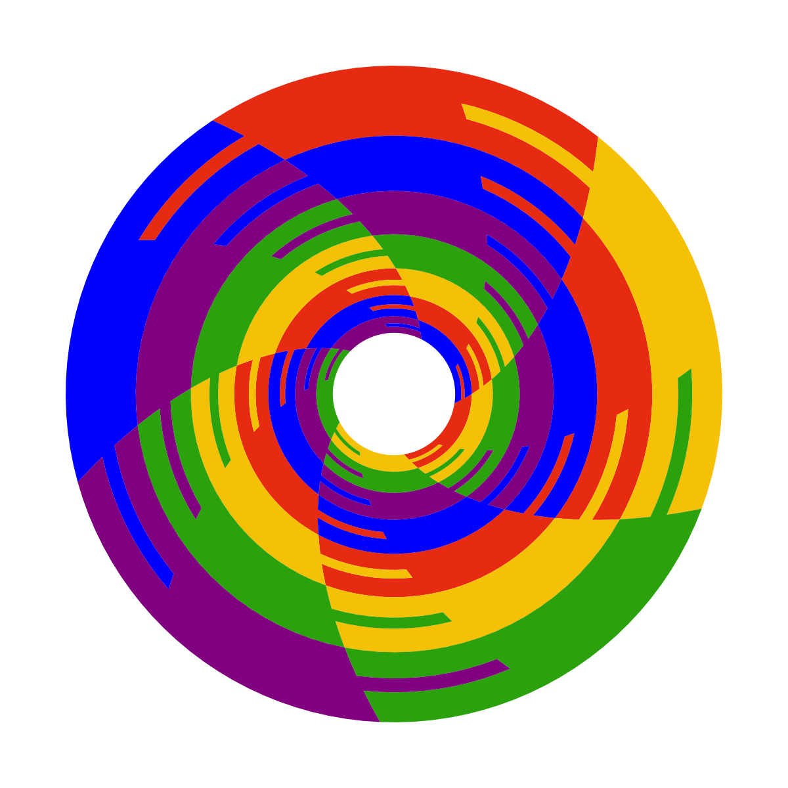

# Tessellate3D - Escher-Style Spiral Vector Engine 

<p align="center">
  
</p>

**Live Demo:** [Tessellate3D](https://justin-koningsberger.github.io/Tessellate3D/) 🚀

I've been creating tessellation SVGs for a few months to print with my 3D printer. I found the usual workflow (using Inkscape to auto-trace an image or completely redraw a single tile inside a complex tessellation) to be really tedious and error-prone.

Inspired by the paper "Generation of advanced Escher-like spiral tessellations" (Ouyang et al., 2022), I built Tessellate3D to dynamically generate tessellation SVG and STL files. I wanted to have a playfull UX, while retaining granular control over the final vector and 3D printed physical output. This engine implements a Forward Mapping pipeline that adapts the paper's framework of cyclic symmetry groups (\(G_k(M, N)\)) and conformal transformations into a native vector workflow. While the original paper leverages fragment shaders for pixel-based canvas rendering, Tessellate3D takes discrete vector shapes, and projects raw path coordinates outward into spiral space. This produces clean path elements native to vector editors like Illustrator or Inkscape, ensuring perfect geometry for 3D prints while leaving the door open to implement their advanced derived mappings later on.

I also see a deep structural link between 3D printing and classical relief printmaking, like the woodcuts of **Frans Masereel**. Both mediums rely on raw material paths, height differences, and crisp perimeters where every single line must be intentional.

---

# Architecture Documentation: Escher Spiral Vector Engine

## Forward vs. Backward Mapping Foundations

### 1. Raster-Based Mapping Methods
* Loops through screen pixel coordinates $(x, y)$ to reverse-map a flat domain space.
* Outstanding for real-time screens, high-resolution shaders, and canvas textures.

### 2. This Engine's Vector-Based Method (Adaptive Forward-Conformal Mapping)
* Loops through structural grid coordinates (Rings and Branches) on an infinite mathematical plane.
* Evaluates path coordinates natively in flat continuous space, eliminating layout grid distortion before applying spatial transformations.
* Processes raw vector shapes (**Base Motifs**) through a highly optimized, conformal warper matrix that scales straight outward from true geometric poles.
* **Dynamic Resolution Engine:** Features an adaptive post-transformation subdivision engine that scales vertex density proportionally with spatial warping and decay. This seals micro-gaps near high-distortion vortex areas while reducing redundant vertex weights in flat zones.
* **Result:** Outputs remarkably lightweight, individual vector paths (`<path d="..." />`) natively readable by Inkscape, Illustrator, and 3D slicers while preserving flawless edge-to-edge interlocking continuity.

---

## Stable Pipeline Components (Phase 1 Conformal Architecture Core)
* **`[Base Motif]`**
  * *Definition:* Resolution-independent vector matrices supporting multi-component elements (outer boundaries and fine internal (open) detail paths).
* **`[Subdivision Engine (subdividePath)]`**
  * *Purpose:* Dynamically samples absolute Euclidean distance post-transformation to inject native flat-space vertices exactly where non-linear curves bend aggressively.
  * *Why:* Keeps geometry perfectly fluid without turning arcs into jagged polygonal chords. It scales its accuracy resolution using the active `decayMultiplier` to optimize performance, while serving as a fine-nozzle FDM feature filter that automatically skips sub-micron details below $0.2\,\text{mm}$.
* **`[Symmetry Engine (applyWallpaperSymmetry)]`**
  * *Purpose:* Stacks interlocking structural tiles edge-to-edge across flat 2D domain space and exponential log-polar coordinate planes matching cyclic symmetry groups $G_k(M, N)$.
  * *Layout:* Concentric depth Rings populate the radial vector path (X-axis translation), while Angular Branches step uniformly (Y-axis translation) to preserve the a-priori $2\pi$ circle wrapper continuity, completely preventing edge tearing.
* **`[Horizontal Affine Shear Matrix & Boundary Sync]`**
  * *Purpose:* Implements rigid shear slopes alongside strict wall-complementarity parsers to align tiling vertices perfectly across layout lanes.
  * *Why:* Eliminates rounding drift, structural gap tearing, and guarantees face-to-face interlocking alignment.
* **`[Pure Conformal Warper Matrix (forward)]`**
  * *Purpose:* Translates linear grid fields into four mathematically isolated, pure complex projections: `logarithmic` ($w = e^z$), `single-pole` (scale-invariant, constant-frequency log-radial flow with exponential decay), `multi-pole` (transcendental, complex analytic sine mapping with trigonometric hyperbolic split), and `loxodromic` (complex-phase, torsional spiral/complex phase twists). Global angle offsets and rotation variables act purely as final rigid coordinate translations, completely decoupling mapping frequency from interactive spatial sliders.
* **`[Stateless Inverse Solver Engines]`**
  * *Context:* TEST & DEBUGGING ONLY
  * *Purpose:* Runs automated bijectivity round-trips to catch spatial transformation drift by passing forward-mapped assets backward through the math stack.
  * *Strategy:* Implements pure mathematical inverses—such as direct algebraic parameter extractions and a dedicated complex inverse sine ($z = \text{asin}(w)$) formulation—mapping transformed dimensions back to flat operational space to assert that output coordinates strictly match initial parameters.
* **`[Multi-Layer Asset Parser & Detached Color Grouper]`**
  * *Purpose:* Encodes a deterministic sorting layer key matching color palette index strings (`colorIndex_hexColor`). This safely segregates primary boundary fills (`compIndex === 0`) into unified, self-contained SVG `<g>` groups while isolating internal decorative line work (`compIndex > 0`) into separate (`colorIndex_hexColor_details`) groups, ensuring reliable layer stacks inside vector illustration tools and multi-material slicers.
* **`[Color Cycler & Validator]`**
  * *Purpose:* Directs index-modulo path coloring across branches, running programmatic bijectivity round-trips to catch sub-micron panel drift.
  * *Grouping Output:* Organizes arrays of mapped coordinates dynamically into structured collections sorted by their deterministic sorting layer keys.

---

## Automated 3D Slicing & Manufacturing Pipeline (New Core Feature)

* **`[Microscopic Alignment Matrix Engine]`**
  * *Purpose:* Guarantees perfect alignment between changing color fields in 3D slicers.
  * *Strategy:* Automatically tracks the absolute extreme minimum and maximum (X, Y) coordinate boundaries across all generated arrays, injecting tiny geometric alignment artifacts at the canvas corners.
* **`[Library-Free ASCII STL Builder]`**
  * *Purpose:* Converts 2D mathematical vector paths into 3D manifolds on the server without heavy 3D rendering dependencies (like Three.js or OpenSCAD).
  * *Strategy:* Standardizes tile winding to counter-clockwise via the Shoelace formula and resolves curved, concave geometries using an ear-clipping triangulation engine. It maps these 2D coordinates straight into a text string template, generating side-wall and top/bottom triangles.
* **`[Dynamic Parameter-Driven Payload Interface]`**
  * *Purpose:* Synchronizes client-side UI manipulation with server-side 3D generation.
  * *Strategy:* Implements a **Group-Aware Hierarchy Context Parser** that isolates independent multi-material base color layers and expands open decorative detail paths using hierarchical fallback `stroke-width` matching attributes.
* **`[Headless Slicer Component Merger]`**
  * *Purpose:* Packages multi-color mathematical tessellations straight into print-ready physical configurations across dynamic canvas shapes.
  * *Strategy:* Automates multi-layer spatial alignment by processing independent material plates and decorative ribbon layers via a microservice. This generates a multi-part STL payload optimized for slicing software.

---

## Prerequisites & Local Validation Environment

This project utilizes advanced ESM features and native testing frameworks.
To run this workspace engine locally, ensure your environment meets these constraints:

* **Node.js:** Runtime `v24.x.x` is required (Native execution spec).
* **Environment Management:** If you have multiple versions active, use [nvm](https://github.com/creationix/nvm) to initialize the target state before executing packages:
  ```bash
  nvm use 24
  npm install
  npm run dev:ui
  ```

## Project Suite Execution Scripts

This project is compiled under a modern, strict `NodeNext` ECMAScript specification framework. Execute these scripts using your npm workspace lifecycle tooling from the repository's root directory:

1. **Local Compiler Test Runner:** `npm run dev` *(Evaluates local configuration layers at `src/config.ts` and outputs test slices into the root directory)*
2. **Master Verification Test Suite:** `npm test` *(Triggers and strings together all tests in series)*
3. **Motif Boundary Constraint Test:** `npm run test:motifs` *(Performs rigorous micro-micron closure checks over the base motifs)*
4. **Mathematical Regression Test:** `npm run test:transforms` *(Asserts forward coordinate vectors against exact algebraic checkpoints)*
5. **Engine Telemetry Fuzzer:** `npm run test:fuzz` *(Runs a deep dual-progression random sweep across varying depth limits and ring layers)*
6. **ZIP Binary Signature Test:** `npm run test:zip` *(Validates PKWARE local file headers, byte offsets, and CRC32 integrity checks)*
7. **Containerized Slicer Microservice:** run `docker compose up -d --build` from the root folder *(Launches Fastify server with a STL generator route)*
